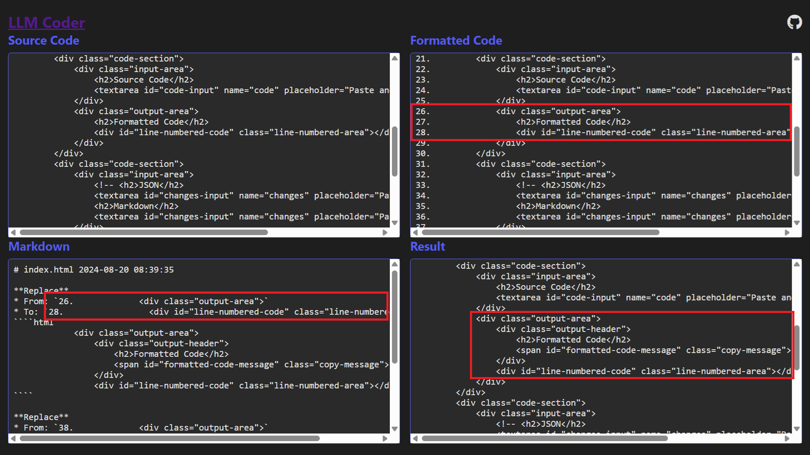

# LLMCoder



## Purpose

LLMCoder is a tool designed to streamline the process of code modification using Large Language Models (LLMs), especially for Claude. It allows you to:

1. Paste your source code and generate line-numbered versions.
2. Use a custom Markdown diff format to guide LLMs in generating code modifications.
3. Apply the changes to your source code automatically, eliminating the need for manual application.

## Origin

LLMCoder was inspired by [hannesrudolph/llm-code-helper](https://github.com/hannesrudolph/llm-code-helper). The original Python code was converted to pure HTML/CSS/JavaScript with the assistance of Claude 3.5 Sonnet, using a single prompt. This conversion allows for easier usage without the need for Python installation.

## Features

- Auto-focus on input areas
- Automatic formatting of code and processing of changes after pasting
- Auto-clearing of input fields
- Full-page layout without scroll bars for improved user experience
- Markdown format for diffs, which:
  - Saves tokens compared to JSON
  - Avoids escape character problems (e.g., forgetting to use \\" in JSON)
  - Improves readability of diff output
  - Enhances manual correction capabilities
- Additional
  - Utilize Claude Artifact
  - Multiple files (conversion not supported yet) with timestamp
  - Syntax highlighting

Read the [instructions/markdown.instruction.en.md](instructions/markdown.instruction.en.md) to understand the detail of Markdown diff.

## Markdown diff sample

> # file1.css 2024-08-14 08:20:42
> 
> **InsertBetween**
> * From: `13. h1 {`
> * To: `14. }`
> ````css
>   color: var(--primary-color);
>   font-size: 1.5rem;
> ````
> 
> **Remove**
> * From: `26.   display: flex;`
> * To: `26.   display: flex;`
> 
> # file2.js 2024-08-15 18:04:05
> 
> **Replace**
> * From: `12.     function old_function() {`
> * To: `15.     return value;`
> ````js
>     function new_function() {
>       var result = 'New function'
> 
>       return result;
> ````

## Usage

1. Clone this repository.
2. Open the `index.html` file in your browser. No Python or additional installation is required.

  Alternatively, you can use the online version: [LLM Coder](https://christorng.github.io/LLMCoder/). It runs entirely in your browser, and no data is sent to any server.

### Integration with Claude

1. Set Claude's Project custom instructions with the content of [instructions/markdown.instruction.en.md](instructions/markdown.instruction.en.md) after your own specific instructions.
2. Ask Claude to modify code. It should follow the instructions and output a Markdown diff.

### Using LLMCoder

1. On the LLMCoder page, paste your source code.
2. Paste the Markdown diff generated by Claude.
3. LLMCoder will automatically apply the changes to the source and copy the result to your clipboard.
4. Paste the modified code back into your IDE to update the source.

## Future Plans

This repository is planned to be integrated into [LLMCoderSync](https://github.com/ChrisTorng/LLMCoderSync). You can use them together now. For more information, please refer to the README.md of [LLMCoderSync](https://github.com/ChrisTorng/LLMCoderSync).
